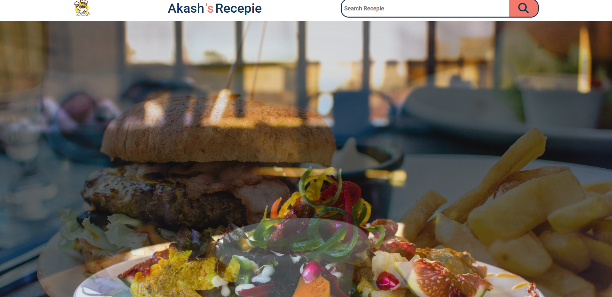

🍳 Akash Recipe 

The Akash Recipe is an interactive web application developed using HTML, CSS, and JavaScript, designed to help users discover delicious recipes from around the world. It uses a public recipe API to fetch real-time data, displaying recipe names, ingredients, images, and cooking instructions instantly. The app features a clean, responsive interface built with modern CSS styling and intuitive search functionality powered by JavaScript. Users can easily enter ingredients or dish names to explore a wide variety of recipes. Through this project, I learned how to handle API integration, JSON data parsing, DOM manipulation, and asynchronous programming using the Fetch API. The Akash Recipe App highlights my ability to build functional and user-friendly web applications that combine logic, design, and live data fetching — demonstrating both my creativity and technical expertise in frontend web development. 

  

Live Website: https://akash8955.github.io/AkashRecepie/

